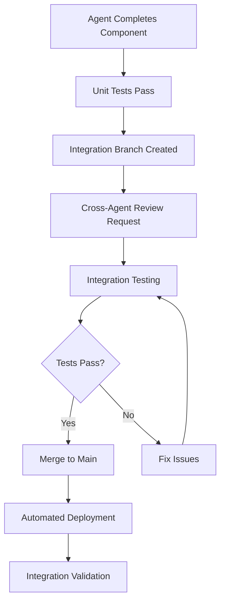

# 🤝 GEO Bot Rebuild - Team Coordination Protocols

**Project:** GEO Bot Rebuild  
**Team Size:** 5 Specialized Agents  
**Duration:** 8 Weeks (Feb 13 - Apr 10, 2026)  
**Coordination Philosophy:** Asynchronous excellence with synchronized checkpoints

## 🎯 Coordination Framework

### Daily Coordination Cycle
```
09:00 Madrid Time → Standup Updates (Async)
14:00 Madrid Time → Cross-team Check-ins  
18:00 Madrid Time → Daily Wrap-up & Blockers
```

### Weekly Synchronization Points
- **Monday 10:00** - Sprint Planning & Goal Alignment
- **Wednesday 15:00** - Mid-sprint Technical Review
- **Friday 17:00** - Sprint Demo & Retrospective

---

## 📝 Daily Standup Protocol

### Async Standup Format
**Location:** `/agent-standups/geo-bot-rebuild/YYYY-MM-DD.md`  
**Deadline:** 09:00 Madrid Time daily  
**Format:**
```markdown
## [AGENT NAME] - Daily Update - YYYY-MM-DD

### ✅ Yesterday's Accomplishments
- [ ] Specific deliverable completed
- [ ] Issue resolved: #123
- [ ] Milestone achieved: X

### 🎯 Today's Focus  
- [ ] Priority 1: Critical path item
- [ ] Priority 2: Secondary objective
- [ ] Priority 3: Enhancement/optimization

### 🚫 Blockers & Dependencies
- **BLOCKED BY:** Waiting for X from [AGENT]
- **BLOCKING:** [AGENT] needs Y from me by [TIME]
- **RISKS:** Potential issues that could affect timeline

### 🤝 Collaboration Requests
- **NEED HELP:** Specific technical assistance needed
- **OFFERING HELP:** Areas where I can assist others
- **SYNC NEEDED:** Face-to-face discussion required

### 📊 Progress Metrics
- **Sprint Progress:** X% complete
- **Quality Score:** Current metrics
- **Performance:** Latest benchmarks
```

### Cross-Team Dependencies Tracking
```markdown
## Daily Dependency Matrix - YYYY-MM-DD

| Provider | Consumer | Deliverable | Due Date | Status | Notes |
|----------|----------|-------------|----------|--------|-------|
| DARWIN | TURING | API data schema | Feb 15 | ✅ | Complete |
| TURING | ELON | Confidence API | Feb 16 | 🔄 | In progress |
| ELON | DIJKSTRA | Intent test cases | Feb 17 | ⏳ | Pending |
| TORVALDS | ALL | Dev environment | Feb 14 | ✅ | Complete |
| DIJKSTRA | TORVALDS | Test coverage report | Feb 18 | 📋 | Planned |
```

---

## 🔄 Sprint Management

### Sprint Planning (Mondays 10:00)
**Duration:** 90 minutes  
**Participants:** All 5 agents  
**Agenda:**
1. **Sprint Review** (15 min) - Previous sprint outcomes
2. **Backlog Refinement** (30 min) - Prioritize upcoming work
3. **Capacity Planning** (20 min) - Realistic commitment assessment
4. **Dependencies Identification** (15 min) - Cross-agent coordination needs
5. **Goal Setting** (10 min) - Sprint objectives and success criteria

**Output:** Sprint board with assigned tasks and clear dependencies

### Mid-Sprint Technical Review (Wednesdays 15:00)
**Duration:** 60 minutes  
**Participants:** All 5 agents  
**Format:**
- **Technical Demos** (30 min) - Show work in progress
- **Integration Testing** (15 min) - Cross-component validation  
- **Blocker Resolution** (15 min) - Address any impediments

### Sprint Demo & Retrospective (Fridays 17:00)
**Duration:** 90 minutes  
**Agenda:**
1. **Demo Session** (45 min) - Show completed work
2. **Metrics Review** (15 min) - Sprint performance analysis
3. **Retrospective** (30 min) - Process improvement discussion

---

## 📊 Progress Tracking & Metrics

### Real-Time Progress Dashboard
**Location:** `/projects/geo-bot-rebuild/dashboard/`  
**Updates:** Automated via CI/CD pipeline + manual agent updates

```json
{
  "sprint_progress": {
    "DARWIN": {
      "tasks_completed": 8,
      "tasks_total": 12,
      "progress_percent": 67,
      "blockers": 0,
      "quality_score": 0.92
    },
    "TURING": {
      "tasks_completed": 6,
      "tasks_total": 10,
      "progress_percent": 60,
      "blockers": 1,
      "quality_score": 0.88
    }
  },
  "team_velocity": {
    "planned_story_points": 50,
    "completed_story_points": 32,
    "burndown_trend": "on_track"
  },
  "quality_metrics": {
    "code_coverage": 0.85,
    "test_pass_rate": 0.96,
    "performance_score": 0.91
  }
}
```

### Weekly Progress Reports
**Format:** Automated generation every Friday at 18:00  
**Distribution:** Project stakeholders + team archive

```markdown
## GEO Bot Rebuild - Week X Progress Report

### 📈 Sprint Summary
- **Velocity:** XX story points completed vs YY planned
- **Quality:** Overall quality score: X.XX/1.0
- **Risks:** Number of active risks: X

### 🎯 Agent Performance
| Agent | Completion Rate | Quality Score | Blockers |
|-------|----------------|---------------|----------|
| DARWIN | 85% | 0.92 | 0 |
| TURING | 75% | 0.88 | 1 |
| ELON | 90% | 0.94 | 0 |
| TORVALDS | 80% | 0.91 | 0 |
| DIJKSTRA | 85% | 0.89 | 0 |

### 🚀 Key Accomplishments
- Major milestone achieved: [Description]
- Integration completed: [Components]
- Performance benchmark: [Metrics]

### 🔴 Risks & Mitigations
- **Risk:** [Description] → **Mitigation:** [Action]
- **Blocker:** [Issue] → **Resolution:** [Plan]

### 📅 Next Week Focus
- Priority objectives for upcoming sprint
- Critical dependencies to resolve
- Quality gates to achieve
```

---

## 🔗 Integration & Handoff Protocols

### Component Integration Process


### Code Review Standards
**Required Reviewers:**
- **Technical Review:** At least 1 other agent with relevant expertise
- **Integration Review:** Any agent whose component interfaces with the change
- **Quality Review:** DIJKSTRA for all production code

**Review Criteria:**
- [ ] Code quality and maintainability
- [ ] Test coverage adequate (>80%)
- [ ] Performance impact assessed
- [ ] Security considerations addressed
- [ ] Documentation updated

### Handoff Documentation Requirements
```markdown
## Component Handoff: [Component Name]
**From:** [Agent] **To:** [Agent] **Date:** [YYYY-MM-DD]

### 📋 Component Overview
- **Purpose:** What this component does
- **Dependencies:** What it requires to function
- **Interfaces:** How other components interact with it

### 🔧 Technical Specifications
- **Architecture:** High-level design
- **APIs:** Input/output specifications
- **Performance:** Benchmarks and SLA requirements
- **Configuration:** Environment variables and settings

### 🧪 Testing
- **Test Coverage:** Current test coverage percentage
- **Test Cases:** Key test scenarios and edge cases
- **Performance Tests:** Load testing results
- **Integration Tests:** Cross-component validation

### 📖 Documentation
- **README:** Location of main documentation
- **API Docs:** Interface documentation
- **Runbooks:** Operational procedures
- **Troubleshooting:** Common issues and solutions

### ✅ Acceptance Criteria
- [ ] All tests passing
- [ ] Performance benchmarks met
- [ ] Security review completed
- [ ] Documentation complete
- [ ] Knowledge transfer session completed
```

---

## 🚨 Escalation & Conflict Resolution

### Escalation Matrix
```
Level 1: Self-Resolution (0-4 hours)
├─ Agent attempts to resolve independently
└─ Consults documentation and previous solutions

Level 2: Peer Assistance (4-8 hours)  
├─ Request help from relevant team member
└─ Cross-agent problem-solving session

Level 3: Team Escalation (8-24 hours)
├─ Bring issue to daily standup
└─ Team brainstorming session scheduled

Level 4: Project Risk (24+ hours)
├─ Formal risk assessment
├─ Timeline impact analysis
└─ Mitigation strategy development
```

### Conflict Resolution Process
1. **Direct Communication** - Agents discuss issue privately
2. **Technical Review** - Focus on technical merits and project goals
3. **Data-Driven Decision** - Use metrics and testing to guide resolution
4. **Team Consensus** - If needed, bring to team vote
5. **Documentation** - Record decision and rationale

### Emergency Response Protocol
**Triggers:**
- Production system down
- Security breach detected
- Critical dependency failure
- Major timeline risk identified

**Response:**
1. **Immediate notification** - Alert all team members within 15 minutes
2. **War room activation** - All hands on deck until resolved
3. **Status updates** - Every 30 minutes during incident
4. **Post-mortem** - Within 24 hours of resolution

---

## 📚 Knowledge Management

### Documentation Standards
**Location:** `/projects/geo-bot-rebuild/docs/`  
**Structure:**
```
docs/
├── architecture/          # System design and architecture
├── api/                  # API documentation and specs
├── deployment/           # Deployment and operations guides
├── development/          # Development setup and standards
├── testing/             # Testing strategies and procedures
└── troubleshooting/     # Common issues and solutions
```

### Knowledge Sharing Protocols
- **Technical Discoveries:** Document in shared knowledge base immediately
- **Lessons Learned:** Weekly compilation of insights and improvements  
- **Best Practices:** Continuous update of team standards and procedures
- **External Research:** Share relevant articles, papers, and industry insights

### Code and Asset Organization
```
/projects/geo-bot-rebuild/
├── README.md                    # Project overview
├── team-profiles/              # Individual agent specifications
├── architecture/               # System design documents
├── src/                       # Source code (organized by component)
├── tests/                     # Test suites and test data
├── docs/                      # Documentation
├── deployment/                # Infrastructure and deployment configs
├── monitoring/                # Monitoring and alerting configs
└── agent-standups/           # Daily coordination files
```

---

## 🎯 Success Metrics & Quality Gates

### Team Collaboration Metrics
- **Communication Efficiency:** Average time to resolve cross-team dependencies
- **Integration Success:** Percentage of first-time successful integrations
- **Knowledge Sharing:** Documentation completeness and usage metrics
- **Conflict Resolution:** Time to resolve technical disagreements

### Quality Gates by Phase
**Phase 1 Gates:**
- [ ] All agents have functioning development environments
- [ ] Cross-agent interfaces clearly defined and agreed upon
- [ ] Basic integration pipeline operational

**Phase 2 Gates:**
- [ ] All major components integrated and communicating
- [ ] Cross-agent code reviews completed for all components
- [ ] Integration tests passing with >90% success rate

**Phase 3 Gates:**
- [ ] Complete system tested end-to-end
- [ ] All quality metrics meeting or exceeding targets
- [ ] Full team knowledge transfer completed

**Phase 4 Gates:**
- [ ] Production deployment successful with zero rollbacks
- [ ] All agents certified on production operations
- [ ] Complete documentation and runbooks delivered

---

## 🌟 Team Culture & Excellence

### Core Values
- **Technical Excellence:** Never compromise on quality for speed
- **Collaborative Ownership:** Every component is everyone's responsibility
- **Continuous Learning:** Share knowledge and improve constantly
- **User Focus:** Everything we build serves the end user better
- **Operational Excellence:** Build systems that work flawlessly in production

### Recognition & Celebration
- **Daily Wins:** Acknowledge significant daily accomplishments
- **Sprint Heroes:** Recognize exceptional contributions each sprint
- **Innovation Awards:** Celebrate creative technical solutions
- **Team Milestones:** Mark major project achievements together

### Continuous Improvement
- **Weekly Retrospectives:** Regular process improvement sessions
- **Tool Evaluation:** Continuously assess and improve our toolchain
- **Skill Development:** Cross-training and knowledge sharing
- **Industry Learning:** Stay current with latest developments

---

*"Individual commitment to a group effort—that is what makes a team work, a company work, a society work, a civilization work."* - The GEO Bot Rebuild Team